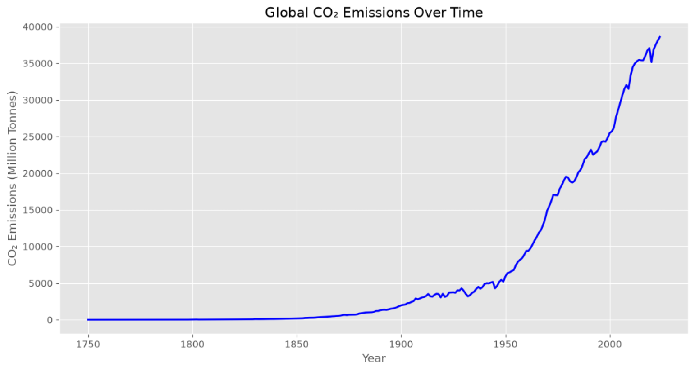
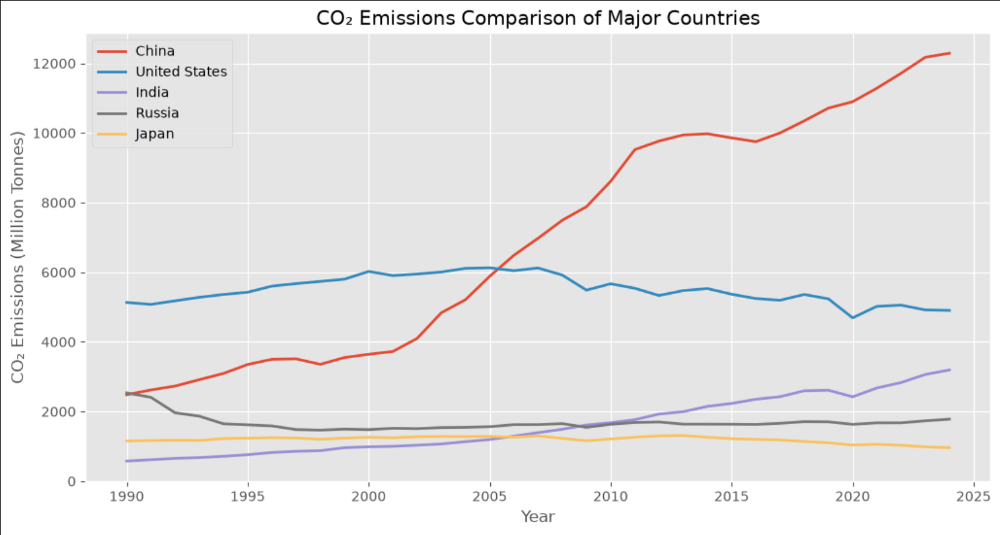
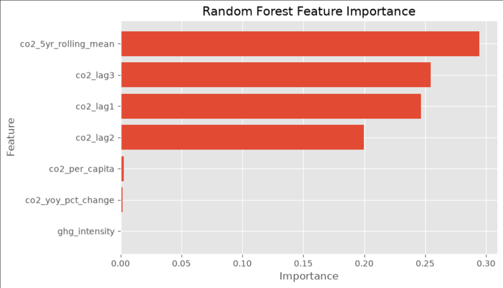
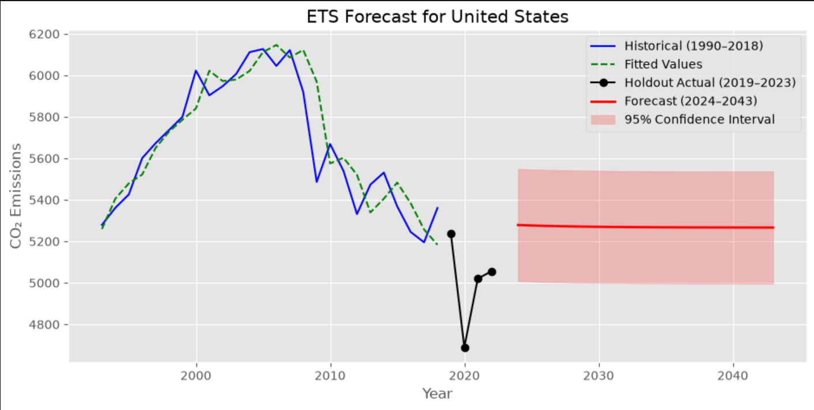

# 🌍 Climate Change Trend Analysis and Forecasting

An end-to-end data science project that analyzes historical greenhouse gas (GHG) emissions using the **Our World in Data (OWID) CO₂ Dataset** and forecasts future emissions using Machine Learning and Exponential Smoothing (ETS).


---

## 🚀 Project Highlights

- Data Cleaning & Preprocessing
- Exploratory Data Analysis (EDA)
- Feature Engineering
- Linear Regression
- Random Forest Regression
- ETS (Holt's Damped Trend) Forecasting
- Future CO₂ Emission Prediction

---

## 🛠 Tech Stack

- Python
- Pandas
- NumPy
- Matplotlib
- Scikit-learn
- Statsmodels
- Jupyter Notebook

---

## 📂 Dataset

**Source:** Our World in Data (OWID)

The dataset contains annual greenhouse gas emission indicators including CO₂ emissions, methane emissions, nitrous oxide emissions, greenhouse gas emissions, country, and year.

---

## 📊 Project Workflow

```
Data Collection
      ↓
Data Cleaning
      ↓
Exploratory Data Analysis
      ↓
Feature Engineering
      ↓
Machine Learning
      ↓
ETS Forecasting
```

---

## 📈 Results

### Global CO₂ Emissions Trend



### CO₂ Emissions Comparison



### Random Forest Feature Importance



### ETS Forecast



---

## 🤖 Models Used

| Model | Purpose |
|-------|---------|
| Naive Baseline | Baseline Forecast |
| Linear Regression | Trend Prediction |
| Random Forest | Regression Model |
| ETS | Time-Series Forecasting |

---

## 📁 Repository Structure

```text
Climate-Change-Trend-Analysis/
│
├── data/
├── images/
├── notebooks/
├── outputs/
├── README.md
├── requirements.txt
└── LICENSE
```

---

## ▶️ Getting Started

Clone the repository

```bash
git clone https://github.com/Varshinisony28/Climate-Change-Trend-Analysis.git
```

Install dependencies

```bash
pip install -r requirements.txt
```

Run the notebook

```bash
jupyter notebook notebooks/ghg_analysis.ipynb
```

---

## 👩‍💻 Author

**Varshini Tumuluri**
