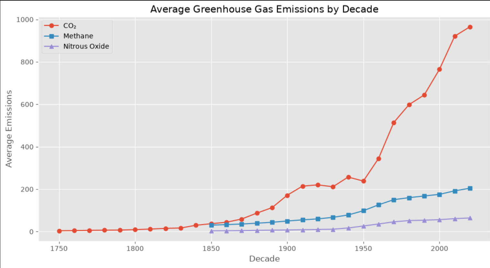
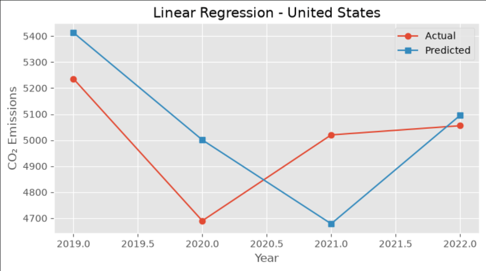
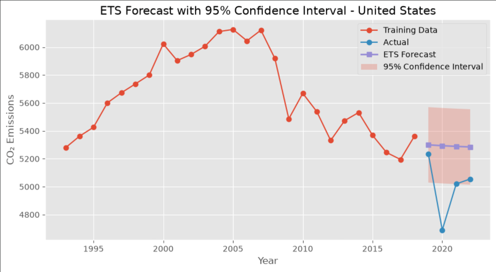

# 🌍 Climate Change Trend Analysis and Forecasting


---


# 📖 Project Overview


Climate change is one of the most significant global challenges of the 21st century. Understanding historical greenhouse gas emission patterns and forecasting future emissions are essential for policymakers, researchers, and environmental organizations.


This project performs a complete end-to-end data science workflow using the **Our World in Data (OWID) CO₂ dataset**. The analysis includes data preprocessing, exploratory data analysis, feature engineering, machine learning models, and time-series forecasting using Exponential Smoothing (ETS).


The objective is to analyze historical emission trends and predict future CO₂ emissions to support data-driven environmental decision-making.


---


# 🎯 Objectives


- Analyze historical greenhouse gas emissions.

- Clean and preprocess climate data.

- Perform exploratory data analysis (EDA).

- Engineer meaningful predictive features.

- Compare multiple Machine Learning models.

- Forecast future CO₂ emissions using ETS.

- Visualize climate trends with informative charts.

- Build a reproducible end-to-end data science workflow.


---


# 📂 Dataset


**Dataset Name**


Our World in Data (OWID) CO₂ Dataset


The dataset contains historical records of greenhouse gas emissions across countries, including:


- CO₂ emissions

- CO₂ per capita

- Methane emissions

- Nitrous Oxide emissions

- Total Greenhouse Gas emissions

- Country

- Year


---


# 🛠 Technologies Used


- Python

- Jupyter Notebook

- Pandas

- NumPy

- Matplotlib

- Scikit-learn

- Statsmodels


---


# 📊 Project Workflow


```


Raw Dataset


↓


Data Cleaning


↓


Exploratory Data Analysis (EDA)


↓


Feature Engineering


↓


Machine Learning Models


↓


Time Series Forecasting (ETS)


↓


Performance Evaluation


↓


Future CO₂ Forecast


```


---


# 📁 Repository Structure


```


Climate-Change-Trend-Analysis/


├── data/

│ └── raw/

│ └── owid-co2-data.csv

│

├── images/

│

├── notebooks/

│ └── ghg_analysis.ipynb

│

├── outputs/

│ ├── ghg_features.csv

│ ├── forecast_summary.csv

│ └── ets_forecast_2043.csv

│

├── README.md

├── LICENSE

├── requirements.txt


```


---


# 📷 Project Preview


## 🌍 Global CO₂ Emissions Over Time


---


## 🌎 CO₂ Emissions Comparison of Major Countries


---


## 🌱 Average Greenhouse Gas Emissions by Decade





---


## 🌲 Random Forest Feature Importance


---


## 📈 Linear Regression Forecast (United States)





---


## 📉 ETS Forecast (United States)


---


## 📊 ETS Forecast with Confidence Interval





---


# 🤖 Machine Learning Models


The following predictive models were implemented and evaluated:


### 1. Naive Baseline


A simple forecasting model that uses the previous year's value as the prediction.


---


### 2. Linear Regression


Linear Regression was trained using engineered climate features to predict CO₂ emissions and establish a baseline supervised learning model.


---


### 3. Random Forest Regressor


Random Forest captured non-linear relationships between climate variables and achieved better predictive performance than the linear model.


---


### 4. Exponential Smoothing (ETS)


ETS was used for time-series forecasting to predict future CO₂ emissions based on historical trends.


The forecast extends to **2043** and includes confidence intervals to quantify forecast uncertainty.


---


# 📈 Outputs Generated


The project generates the following output files:


| File | Description |

|------|-------------|

| `ghg_features.csv` | Engineered features used for machine learning |

| `forecast_summary.csv` | Forecast evaluation summary |

| `ets_forecast_2043.csv` | Future CO₂ emission forecasts |


---


# 📊 Exploratory Data Analysis


The analysis includes:


- Global CO₂ emission trends over time

- Comparison of emissions across major countries

- Decadal greenhouse gas emission analysis

- Missing value analysis

- Country-wise data availability

- Feature correlation analysis

- Time-series visualization


---


# ⚙️ Feature Engineering


Several predictive features were created to improve model performance:


- Decade

- Years Since 1990

- Rolling Mean

- Lag Features (Lag1, Lag2, Lag3)

- Greenhouse Gas Intensity

- Year-over-Year Percentage Change


These engineered features significantly improved forecasting performance.


---


# 📌 Key Findings


- Global CO₂ emissions have shown a significant upward trend over the past decades.

- China has emerged as the largest contributor to global CO₂ emissions, while India shows a steadily increasing trend.

- Feature engineering (lag variables, rolling averages, and greenhouse gas intensity) improved the performance of predictive models.

- Random Forest outperformed the Linear Regression model by capturing non-linear relationships in the data.

- Exponential Smoothing (ETS) effectively forecasted future CO₂ emission trends and provided confidence intervals for predictions.

- Time-series forecasting demonstrates how historical climate data can support evidence-based environmental planning and policy decisions.


---


# 🚀 Future Work


This project can be extended in several ways:


- Implement advanced forecasting models such as ARIMA, SARIMA, Prophet, or LSTM.

- Incorporate additional variables such as GDP, population, renewable energy usage, and temperature anomalies.

- Develop an interactive dashboard using Streamlit or Dash for real-time visualization.

- Automate periodic data updates and model retraining.

- Expand the analysis to include more environmental indicators and country-level comparisons.


---


# ⭐ Project Highlights


- ✔️ End-to-end Data Science project

- ✔️ Data Cleaning and Preprocessing

- ✔️ Exploratory Data Analysis (EDA)

- ✔️ Feature Engineering

- ✔️ Machine Learning Model Comparison

- ✔️ Time Series Forecasting using ETS

- ✔️ Professional Visualizations

- ✔️ Reproducible Workflow

- ✔️ Well-Documented GitHub Repository


---


# 📚 References


- Our World in Data (OWID) CO₂ Dataset

- Scikit-learn Documentation

- Statsmodels Documentation

- Pandas Documentation

- NumPy Documentation

- Matplotlib Documentation


---


# ▶️ How to Run the Project


1. Clone this repository.


```bash

git clone https://github.com/Varshinisony28/Climate-Change-Trend-Analysis.git

```


2. Move into the project folder.


```bash

cd Climate-Change-Trend-Analysis

```


3. Install the required libraries.


```bash

pip install -r requirements.txt

```


4. Open the notebook.


```bash

jupyter notebook notebooks/ghg_analysis.ipynb

```


---


# 👩‍💻 Author


**Varshini Sony**


Climate Change Trend Analysis and Forecasting Project


Developed as part of an internship project demonstrating data preprocessing, exploratory data analysis, machine learning, and time-series forecasting using Python.


---


# 📄 License


This project is licensed under the MIT License.


See the `LICENSE` file for more details.


---


## ⭐ If you found this project useful, consider giving it a star on GitHub!


Thank you for visiting this repository.

